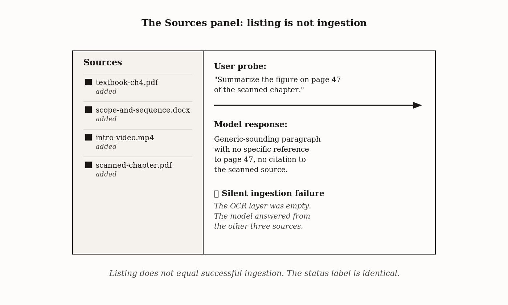

# Chapter 2 — Your First Notebook: Thirty Minutes to Output

*The notebook said it had the chapter. It did not have the chapter. Nobody warned her.*

---

Here is a thing that happened.

A high school teacher uploaded a textbook chapter to NotebookLM. The chapter lived inside a scanned PDF — photographed pages, saved as a file. The Sources panel listed it. She asked the notebook to summarize the key concepts. Three paragraphs came back, fluent and confident. She moved on.

Two weeks later, a student gave a quiz answer referencing something the teacher didn't recognize. She went back to the textbook. The concept wasn't in chapter 4. She went back to the notebook. The summary had drawn from a study guide she'd uploaded for a different unit entirely. The scanned PDF had contributed nothing — no text, no concepts, no words. The model had answered from whatever it could read, which wasn't the chapter she thought she was asking about.

The notebook never said anything was wrong.

That's the problem this chapter is built around. Not that NotebookLM makes mistakes — every system does. The problem is that it can fail *silently*, in ways that look exactly like success, and the only thing standing between you and that teacher's situation is knowing where to look and what to ask.

Thirty minutes. Three source types. Three outputs. One verification discipline. That's the whole chapter.

---

## Why the Sources Panel Lies to You (and Doesn't Know It)

*Figure 2.1 — The Sources panel: listing is not ingestion*

Let me be precise about what I mean. The Sources panel doesn't lie because NotebookLM is dishonest. It lies because the *listing of a file* and the *extraction of its text* are two separate operations, and the interface only shows you the first one.

When you upload a PDF, NotebookLM accepts the file, records that it exists, and runs it through an extraction pipeline. That pipeline pulls out the words. But if the PDF is a photographed page — pixels arranged to look like text, not actual text characters — the pipeline finds nothing to pull. Or it finds fragments. Or it finds garbled output that looks like words and isn't. The file is still listed. The notebook still answers questions. It answers from whatever other sources it has.

| Source type | Failure mode | What the user sees | How to detect it |
|---|---|---|---|
| Heavily-formatted PDF (academic two-column, complex tables, embedded equations) | Text-extraction layer drops content silently | Source listed as "added"; uploaded successfully | Ask the model a question about specific content in the source. If the answer is empty or generic, the text didn't extract. |
| Scanned document without OCR text layer | Model extracts no usable text or garbled fragments | Source listed; no error | Same as above — content-specific probe question. Garbled output is also a tell. |
| Audio file over the per-file size limit | Transcription truncates at the cutoff; remainder is invisible | Source shows as ingested at full duration | Ask about content from the back half of the audio. If responses only cover the early portion, the audio truncated. |
| YouTube video without captions, or with low-quality auto-captions | Transcript text misrenders technical terms, names, foreign-language passages | Source listed; transcript appears to exist | Ask about a specific technical term you know is in the video. If the model uses a wrong-but-phonetically-similar word, the auto-caption failed. |
| Google Doc with live sync | Recent edits don't re-index immediately; model answers from older version | Source listed; sync indicator may not be visible | Ask about a recent edit. If the model doesn't see it, sync hasn't refreshed. |
There are five patterns worth knowing:

**Scanned PDFs without an OCR text layer.** This is what caught the teacher. A page photographed and saved as PDF contains no character data — it's an image. The extraction pipeline has nothing to work with. You get a listing in the Sources panel and nothing else.

**Heavily formatted PDFs.** Academic papers in two-column layout, documents with complex tables, files with equations typeset as images. The extraction pipeline handles these unevenly. Some sections come through clean; others get dropped or scrambled. The model answers from what it has, and you can't tell what that is without checking.

**Audio files over the per-file limit.** Long recordings get transcribed only to the cutoff. The notebook doesn't tell you where the transcript stops. If your lecture runs ninety minutes and the limit is sixty, the last thirty minutes don't exist in the notebook's working memory.

**YouTube videos with poor captions.** The notebook transcribes from the video's caption track. If the video has no captions, or auto-generated captions for a speaker with a heavy accent, or a lecture full of technical terminology that auto-captioning mangles — the transcript the notebook works from is corrupted at the source. Every summary and flashcard inherits that corruption.

**Google Docs that were recently updated.** The notebook indexes the doc at upload time. If you revise the doc later, the notebook may still be working from the earlier version. The live-sync is not always immediate, and the interface doesn't show you a version timestamp.

The pattern across all five is the same: the interface shows you a file name, and you assume that means the content is available, and that assumption is the gap everything falls through.

How do you close the gap? You ask a question you already know the answer to. Not "summarize this chapter" — a question that requires the notebook to retrieve something *specific*. A term defined on page 12. A claim made in paragraph three. A name that appears only in the source you're testing. If the answer is wrong, generic, or confident about something that isn't in the source, you know the ingestion failed. If the answer is right, you have evidence — not proof, but evidence — that extraction worked.

This is the first habit the chapter is building. Not trust. Verification.

---

## What the Studio Panel Actually Produces

<!-- → [INFOGRAPHIC: Visual map of all NotebookLM Studio output types grouped by format category — Audio, Video, Document, Study, Data — with brief annotation of what each is for] -->

Once you have sources you've verified, you can generate outputs. The Studio panel is where this happens — the right-hand pane that offers a menu of artifact types.

The full list as of writing: Audio Overview (standard and Interactive), Video Overview, Cinematic Video, Slide Deck, Infographics, Mind Map, Study Guide, Flashcards, Quizzes, Data Tables, Reports. The list has grown since NotebookLM launched and will keep growing. What matters for this chapter isn't the full menu — it's understanding what each *type* of artifact optimizes for, so you can choose deliberately instead of experimentally.

Think about three axes. The first is *structure*: how much the output organizes information versus presents it. A Study Guide is highly structured — headings, key terms, organized sections. An Audio Overview is loosely structured — conversational, flowing, designed for listening. The second axis is *register*: is this production-facing or consumption-facing? A flashcard set is a tool a student produces an answer against. An audio overview is something a student consumes. The third axis is *verifiability*: does the output make it easy or hard to check each claim against the source?

| Output type | Structure | Register | Verifiability |
|---|---|---|---|
| Audio Overview | Conversational dialogue, two-host podcast format | Informal, accessible | Citation-grounded but harder to spot-check while listening |
| Video Overview | Narrated sequence with diagrams and quotes | Mixed informal/instructional | Citations visible on screen; pausable |
| Study Guide | Outlined hierarchy with key terms, essay prompts, sample quizzes | Instructional, structured | Direct citation per section; easy to audit |
| Flashcards | Discrete Q&A pairs | Test-prep concise | Each card cites source passage; click-through verification |
| Quiz | Multiple choice or short answer with reveal | Assessment | Answer key cites source; verify question framing against passage |
| Mind Map | Interactive nodes with clickable branches | Conceptual | Citations on node hover; structure choices need teacher review |
| Briefing Doc | Structured prose handout | Professional / academic | Inline citations; the most readily verifiable text output |

*Choose by what the student should be doing — and by what you can audit before distribution.*
This chapter uses three outputs because each one sits differently on those axes and makes the verification problem show up differently.

The **Study Guide** is structured and production-facing and — crucially — it cites heavily. Every section, every key term, every practice question carries citations you can click. This makes the Study Guide the easiest output to verify and therefore the right place to start building the verification habit.

The **Audio Overview** is unstructured and consumption-facing and *does not cite at all*. You can't click anything while you're listening. The claims flow past without anchors. This is fine for what an audio overview is for — a 10-minute podcast-style introduction that a student might listen to on the way to class — but it means verification requires a different move: you follow along in the source while listening and notice what the audio leaves out, not what it gets wrong.

The **Flashcard set** is tightly structured, test-facing, and cites at the card level, but the citation points to the passage the answer drew from, not to the full context that would tell you whether the answer is *correct*. A passage can be accurately retrieved and the flashcard's answer can still be wrong — because the model paraphrased, or simplified, or dropped the qualifier that made the claim true. The flashcard verification task is therefore the subtlest of the three: you're not just checking whether the source says something, you're checking whether the card's version of what the source says is actually right.

Three outputs. Three different relationships to verifiability. One discipline that applies to all of them.

---

## The Verification Stack

<!-- → [INFOGRAPHIC: Three-step verification stack as a visual checklist — Step 1: Does the passage exist? Step 2: Does it support the claim? Step 3: Is anything omitted that changes the meaning?] -->

Here is the thing about citations. They answer a narrow question: *where did this come from?* They do not answer the question you actually care about: *is this right?*

Those are different questions.

A citation tells you the model found a passage in your source and used it. Verifying a citation — actually clicking it, reading the passage — tells you the passage exists. These are both useful facts. Neither of them tells you whether the output's *characterization* of the passage is accurate.

Here's why that matters. Suppose a chapter says: "Spaced repetition is effective for memorizing vocabulary, though the evidence for complex procedural skills is thinner." A flashcard could draw on that passage and produce a card that reads: "What technique is effective for memorizing vocabulary?" Answer: "Spaced repetition." The citation would check out. The passage exists. The passage does support the claim. But the card has dropped the qualifier — the fact that the evidence is domain-specific — and a student who memorizes that card will believe spaced repetition is broadly effective when the source said something more nuanced.

That's the third check in the verification stack, and it's the one that requires you to *read the passage* rather than just confirm it exists.

The stack, stated plainly:

1. Does the cited passage exist in the source? (Click. Read.)
2. Does the passage actually support the claim the output makes? (Not just "is this passage about this topic" — does it support *this specific claim*?)
3. Does the passage, read in full and in context, say something importantly different from what the output claims?

The third check is where domain expertise matters. You know the source. You know when a paraphrase flattens something that shouldn't be flattened. A student checking the same citation may confirm the passage exists and move on, not knowing enough to notice the qualifier that was dropped. That's the gap you're there to close.

The verification discipline is not a bureaucratic step. It is *the* reason a human expert is in the workflow at all.

---

## The Thirty-Minute Walkthrough

| Time window | Action | What to check | What failure looks like |
|---|---|---|---|
| Minutes 0–5 | Upload three sources (PDF, Google Doc, YouTube URL) | Each source's ingestion status; ask one specific-content probe per source | Source listed but probe returns generic or wrong answer → silent ingestion failure |
| Minutes 5–10 | Generate Study Guide | Click three citations; confirm passage exists, supports claim, omits nothing critical | Citation jumps to wrong passage, or passage exists but is qualified more than the response suggests |
| Minutes 10–20 | Generate Audio Overview (10 min target) | Listen while reading source; note one specific omission | Audio omits a section you would expect a student to need; reframes a qualified finding as definitive |
| Minutes 20–30 | Generate Flashcard set | Take the flashcards; note one debatable card | "Correct" answer is technically defensible but tests the wrong thing, or is ambiguous |

*Output of the walkthrough: a list of at least three identified errors — one per output type. That list is the deliverable, not the artifacts.*
Here is what you do.

**Minutes 0 to 5: Upload three sources.**

Upload a PDF (a paper or textbook chapter), a Google Doc (your lecture outline or notes), and a YouTube URL (a lecture or talk relevant to your subject). Watch the ingestion status on each. Note anything that fails immediately. Then ask a specific question about each source — something factual, something you know the answer to — and check the response. You are not looking for a good summary. You are checking whether the source's text is actually available to the model.

**Minutes 5 to 10: Generate a Study Guide.**

Open Studio. Generate a Study Guide. Read it. Then click three citations — not the same section, three different places in the guide. For each: does the passage exist? Does it support the claim? Does reading the full passage change anything? Note what you find. One accurate citation, one citation that checks out but dropped a qualifier, one citation that surprises you in any direction. Three is enough to calibrate.

**Minutes 10 to 20: Generate an Audio Overview.**

Target ten minutes. While it plays, follow along in your source. You're listening for what the audio *leaves out*, not just what it gets wrong. Omissions are the characteristic failure mode of consumption-facing outputs — the model summarizes, compression happens, nuance doesn't make it. Notice one specific thing the audio left out that you think would matter to a student. Write it down. That specific omission is the deliverable from this section, not the audio itself.

**Minutes 20 to 30: Generate a Flashcard set.**

Take the flashcards. Answer them as a student would. Find one card whose "correct" answer is genuinely debatable — wrong, partial, or testing the wrong thing. Check the cited passage. Read it. Decide whether the card's answer follows from the passage or whether something was lost in translation. Note the gap.

At the end of thirty minutes you have a list: at least three identified errors, omissions, or weaknesses, one per output type. That list is the deliverable. Not the Study Guide. Not the audio. Not the flashcards. The trained eye that found the problems.

---

## What These Failures Have in Common

<!-- → [INFOGRAPHIC: Diagram showing the three failure types from the walkthrough mapped to the verification stack — visual connection between omission/mischaracterization/ingestion failure and which check in the stack catches each] -->

Every failure in the walkthrough traces back to the same structure. The model had information. It generated output. The output was shaped by what was available, what was emphasized, and what got compressed. You were not there for that process. The output looks like a finished product. It reads like something that knows what it's talking about. And you, with domain expertise, are the only thing in the loop that can tell whether it does.

This is not a flaw in NotebookLM specifically. It is the fundamental condition of using any generative system for high-stakes output. The system's job is to produce fluent, coherent, grounded text. Your job is to verify that "grounded" means what it should mean. Those are different jobs, and the tool can't do yours.

The silent ingestion failure that caught the teacher is the most dramatic version of this problem — a source that contributed nothing, invisible. But the quieter versions are more common: a flashcard that dropped a qualifier, an audio overview that summarized the introduction and skimmed the methodological section that mattered most, a study guide citation that retrieved the right passage and paraphrased it in a way that made a hedged claim sound like a firm one.

The verification stack catches all of them, if you use it.

---

## What Would Change Any of This

One thing would shift the chapter's emphasis significantly: a visible extraction confidence indicator in the Sources panel. If NotebookLM showed you — clearly, in the interface — that a given source had extracted cleanly, partially, or failed, the silent-failure problem becomes a different problem. You'd still need the verification stack for output-level checks. But the ingestion step would become navigable at a glance rather than requiring a test query. As of writing, no such indicator exists.

Three questions still open:

How often, in real classroom use, do silent ingestion failures actually occur? There's no public data. The teacher's case is documented; the base rate is not.

Does the Interactive Audio mode — where a student can pause and ask questions — produce better verification behavior than the standard Audio Overview? It's plausible. A student who can interrogate the audio is implicitly checking claims. Whether students do this, and whether it catches the right errors, is unmeasured.

Should the verification discipline be taught as a transferable skill — independent of NotebookLM, applicable to any AI-generated output? The three-step stack predates this tool and will apply to whatever replaces it. The answer to this question is almost certainly yes, and where you put it in the curriculum is a design decision, not a factual one.

---

## LLM Exercises

1. Paste the Study Guide you generated in the walkthrough into a new conversation with an LLM. Ask it to identify three places where a hedged or qualified claim in the original source might have been flattened into a simpler claim in the Study Guide. Compare its findings against your own verification notes. Where did it catch something you missed? Where did you catch something it didn't?

2. Take the flashcard you flagged as debatable. Paste the card, the cited passage, and the surrounding context into an LLM. Ask it to evaluate whether the card's answer is justified by the passage. Ask it to rewrite the card to better capture what the passage actually says. Use its rewrite as a starting point — not an endpoint — and note what you would change before using the card with students.

3. Feed the Audio Overview transcript (if downloadable) and the original source into an LLM. Ask it to list concepts present in the source but absent from the transcript. Cross-reference against the omission you identified in the walkthrough. Did the LLM find your omission? Did it find omissions you missed? What does the difference tell you about the limits of automated gap-detection?

---

## Chapter Summary

You can now recognize the five characteristic patterns of silent ingestion failure and test for them before trusting a source is available. You can generate three output types — Study Guide, Audio Overview, Flashcards — and apply the verification stack to each. You know that "the citation exists" and "the output is correct" are different questions, and you know where the difference lives: in the third check, reading the passage in full, noticing what was dropped.

The one idea from this chapter that matters most: the Sources panel tells you a file was accepted. It does not tell you a file was read. The verification discipline is how you find out which one happened.

The common mistake: clicking a citation and stopping at "the passage exists." That's the first check. The discipline requires all three.

The Feynman test: explain to someone who has never used NotebookLM why a response with citations can still be wrong. If you can do that — if you can walk them through what a citation actually confirms and what it doesn't — you have the chapter.

---

## Where This Leads

The walkthrough established that you can generate outputs and verify them. Chapter 3 reframes the question. Now that you know how to check outputs, how do you decide *which* output to ask for in the first place? That's not an experimental question — try things and see what sticks. It's a pedagogical one: what is the student supposed to *do* with what you give them, and which output format serves that goal? The choice of artifact is a teaching decision, and Chapter 3 is where you learn to make it deliberately.

---

*Specific output names — Cinematic Video, Interactive Audio, Lecture Format if launched — and the Studio panel layout are evolving. The verification discipline is not. Re-verify the output list against the current interface before each reprint; leave the three-step stack alone.*
