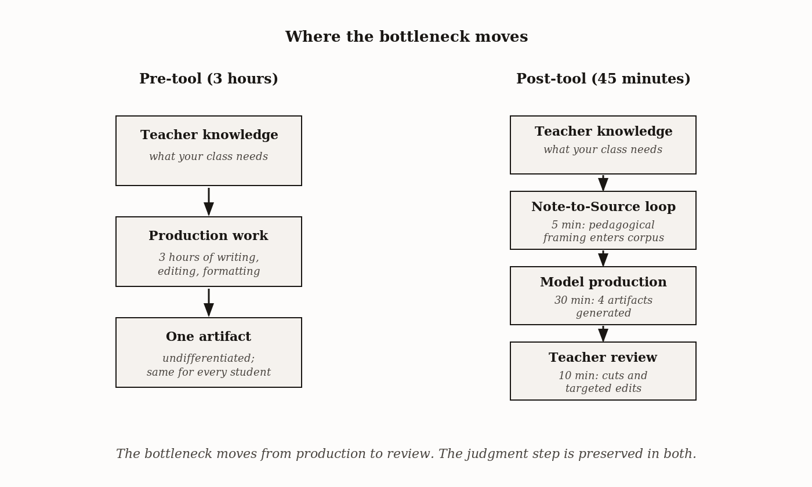
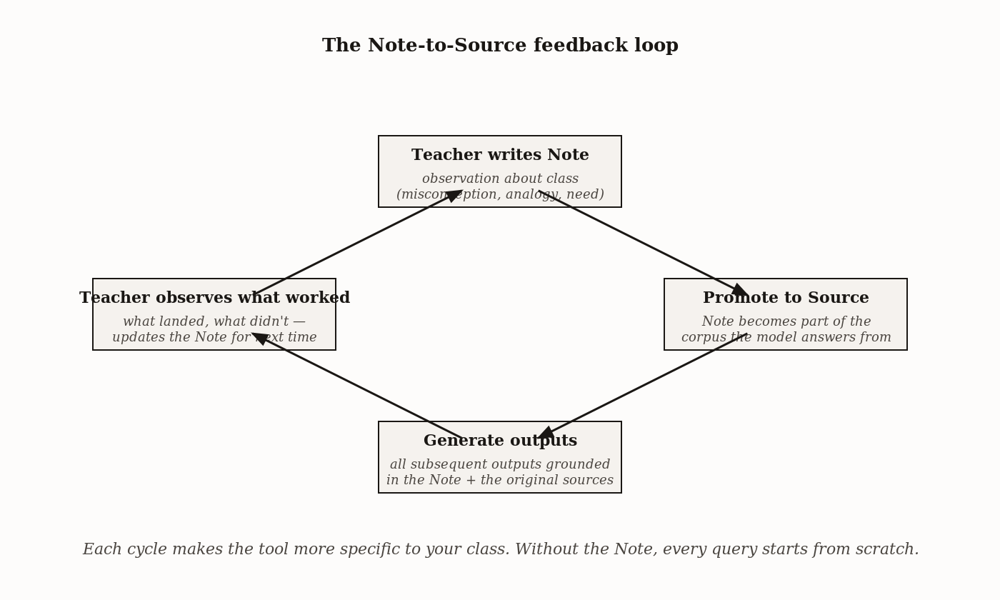

# Chapter 4 — The K–12 Teacher: From Curriculum to Classroom

## TL;DR

- Where the production bottleneck was, and what happens when it moves.
- The chapter moves through What the tool is actually doing in a K-12 context, The five-step sequence, Tiered scaffolds, The Note-to-Source loop, and related ideas.
- Read it for the main argument, the vocabulary it introduces, and the practical judgment it asks you to develop.

*Where the production bottleneck was, and what happens when it moves.*

---

Here is a problem that has a specific shape.

A teacher walks into a classroom with thirty students. Those thirty students do not read at the same level. They do not have the same prior knowledge. They do not respond to the same analogies. The teacher knows this — has known it for years — and knows exactly what the right response is: differentiated materials, tiered for the actual distribution of the class. Extension work for the students who will be bored by the textbook. Vocabulary support for the students who will be lost before the second paragraph. Formative questions calibrated to what *this* class tends to get wrong about *this* topic.

The teacher also knows that producing those materials takes three hours she does not have on a Sunday night. So she makes one version and teaches to the middle and notes in her head that she meant to differentiate and didn't. This is not a failure of intention. It is a failure of throughput.

The question worth asking precisely is: what, exactly, is the bottleneck? Not "teachers don't have time" — that is a description, not an analysis. The bottleneck is *production*. The teacher already knows the three versions she wants to make. She knows the vocabulary box the lower-tier version needs. She knows the extension questions the upper-tier version should include. She knows the analogy that lands with *this* class and the analogy that doesn't. The knowledge is there. The hours to translate that knowledge into formatted documents are not.

When you understand the bottleneck that precisely, you can ask a more precise question about any tool that claims to address it: *does this tool move the bottleneck, or does it just move it somewhere else?*

---

## What the tool is actually doing in a K-12 context

Chapter 1 established that NotebookLM answers from the sources you upload, with citations back to those sources. Chapter 3 introduced the Note-to-Source mechanism. The K-12 application is what happens when those two architectural facts collide with the production-bottleneck problem.

The collision goes like this. You upload the materials you are already required to use — the district-approved textbook chapter, the scope-and-sequence document, the relevant state standards. The model can now answer questions about those materials, synthesize them, and generate derivative outputs — Briefing Docs, Audio Overviews, slide decks, formative assessments — all sourced from and cited back to the documents you uploaded.

The derivative outputs are the production step. That step, which previously took three hours, now takes 45 minutes. The 45 minutes includes review time — and I want to be exact about what review time means here, because the chapter's entire argument depends on it.

Review time is not optional finishing. It is the step where your knowledge of your specific class enters the process. The model produced a vocabulary-supported version of the cellular respiration chapter. Does that version still reach the same learning goal, or did simplification remove a load-bearing piece of the explanation? The model produced ten formative assessment questions. Are any of them ambiguous, or do they test vocabulary you haven't introduced yet? The model's Audio Overview used a battery analogy for the proton gradient. You would have used a dam analogy, because that's the one that lands with this class. These are not corrections of AI error. They are the application of knowledge the model cannot have — your knowledge of the thirty specific students in front of you Monday morning.

This is the answer to the bottleneck question. The tool moves the production bottleneck. It does not touch the judgment bottleneck, because the judgment bottleneck is not a bottleneck — it is the work. Production without judgment is faster *and worse*. Production with judgment, when production is no longer the constraint, is faster *and better*. That is what the 45-minute workflow is designed to produce.

*Figure 4.1 — Where the bottleneck moves*

---

## The five-step sequence

The workflow has five steps. I will describe them in order and then explain why the order matters.

**Upload.** Three sources: the textbook chapter as a PDF, the district scope-and-sequence document, the relevant state standards. This step is five minutes if the sources are already in digital form. Watch the ingestion — if the textbook PDF is heavily formatted or scanned from print, ask a specific content question to confirm the text was extracted correctly. A scanned PDF that ingested poorly will produce outputs that look plausible and are missing content.

**Briefing Doc.** Generate it. Then verify three citations — pick three claims in the document and click through to the source. If the doc misses a section that matters to your unit, regenerate with a prompt that names the section explicitly. The Briefing Doc is not an end product; it is a quality check. If the model misrepresents your sources at this stage, the downstream outputs will be worse. Finding the error here costs two minutes. Finding it in a formative assessment you have already distributed costs a class period.

**Audio Overview.** Use a specific prompt, not a generic one. The difference between "generate an audio overview" and the following prompt is substantial:

> *"Focus on the three core concepts in chapter 4 that a 9th-grade student will struggle to grasp. Target a 12-minute run time pitched at a 9th-grade reading level. Include the egg-counting analogy from the Note pinned to source 4."*

The specificity matters for the same reason that specificity always matters in retrieval: the model retrieves what you ask for. A vague prompt retrieves a vague result. Listen to the audio while reading the source — ten minutes of parallel processing. Note one place where the audio handles a concept differently than you would. That note becomes the first five minutes of Monday's lecture: *"The audio used a battery analogy. Here's why I'd use a dam instead, and here's what each one gets right."* That is not a correction of an AI error. It is a use of the divergence.

**Slide Deck.** Generate twelve slides. Export to PPTX. Manually edit three or four slides — the opener, the diagnostic question slide, the closing synthesis. The model handles consistency and layout. You handle the slides that carry the most cognitive weight. Do not regenerate the whole deck to fix the opener. Edit the opener. Regeneration changes everything at once and can introduce new problems while fixing the one you saw.

**Formative Assessment.** Generate ten questions mapped to Bloom's levels. Review every question. Cut the 20% that are ambiguous, poorly framed, or that test something you haven't taught yet. This cut is not optional. An unreviewed quiz that goes out with a bad question produces a classroom problem — students who answered the question correctly according to one reasonable reading of it, students who answered it correctly according to a different reasonable reading, and a grade dispute that costs fifteen minutes of class time and twenty minutes after school. The review takes three minutes. The dispute takes thirty-five. The math is not subtle.

| Step | Time | What you do | What the model does | What breaks without this step |
|---|---|---|---|---|
| Upload | 5 min | Add textbook chapter, district scope-and-sequence, state standards; verify ingestion with a content-probe question per source | Indexes the three sources, displays "added" status | Silent ingestion failure on a key source produces downstream outputs grounded in only two of three references — invisible from the chat interface |
| Briefing Doc | 5 min | Verify three citations against textbook; regenerate with a targeted prompt if a key section is missed | Generates structured student handout from the three sources | Doc omits a section you teach explicitly; you discover it during lecture, not before |
| Audio Overview | 10 min | Listen at 1.5× while reading the chapter; note one omission for verbal lecture; assign as preview, not replacement | Generates 10–12 minute two-host audio at specified reading level | Audio uses an analogy that contradicts your standard framing; students arrive Monday with the wrong mental model |
| Slide Deck | 10 min | Edit 3–4 most consequential slides (opener, diagnostic, closing synthesis); export to PPTX | Generates 12-slide deck with auto-layout and content | Generic openers and bulleted closings; the slides that carry the lecture's weight get the least attention |
| Formative Assessment | 15 min | Review every question; cut the 20% that are ambiguous, off-topic, or pedagogically weak | Generates 10-question Bloom's-mapped assessment | Three weak questions ship to students; afternoon spent regrading and re-teaching the misframed concept |

*The 45-minute figure is wall time including review. Each "what breaks" entry names the specific downstream failure the step prevents.*
---

## Tiered scaffolds

The production bottleneck makes itself felt most acutely in differentiation, which is why it is worth treating separately.

A tiered scaffold is three versions of the same content — extension, on-level, vocabulary-supported — all aimed at the same learning goal. The idea is not new; the problem is always that producing three versions of anything takes three times as long as producing one. When the bottleneck is production time, differentiation is the first thing that gets cut.

The prompt that generates a usable three-tier scaffold looks like this:

> *"Produce three versions of the chapter 4 reading.*
> *Version 1: extension version for advanced readers. Include additional context, advanced vocabulary, and comprehension questions at Bloom's Apply level.*
> *Version 2: on-level version. No scaffolding changes; the textbook's intended reading level.*
> *Version 3: vocabulary-supported version. Pre-defined glossary box inline for the terms [list]. Average sentence length under 15 words. Technical terms introduced one at a time."*

The on-level version is easy and mostly reliable. The extension version is usually fine. The vocabulary-supported version is the one to examine carefully. Simplification of sentence structure is mechanical and the model does it well. Simplification of content is not mechanical, and the model sometimes removes a technical term to reduce difficulty and inadvertently removes the concept that term was carrying. A student who reads a version 3 that has been over-simplified will reach the end of the document and miss the learning goal — not because they couldn't handle the concept, but because the scaffolded version didn't deliver it.

The check is specific: take the vocabulary-supported version and ask, for each learning objective, whether the version gives the student enough to demonstrate that objective. If the objective is *"explain how ATP stores and releases energy,"* does version 3 contain a sentence the student could use to construct that explanation? If it doesn't, the simplification went too far. Add the sentence back.

| Version | Reader target | Vocabulary handling | Cognitive demand | Where errors typically appear |
|---|---|---|---|---|
| Extension | Advanced readers | Additional context and technical vocabulary introduced beyond textbook | Bloom's Apply / Analyze comprehension questions | Rare; the model can extend confidently because it has more source content to draw on |
| On-level | The textbook's intended grade level | Textbook's own vocabulary preserved | Same as textbook | Minimal — this version is closest to the source |
| Vocabulary-supported | Developing readers | Inline glossary box for technical terms; sentence length capped (e.g., under 15 words avg); technical terms introduced one at a time | Reduced; some Apply-tier questions converted to Understand | Most common: simplification removes load-bearing content — the connecting argument disappears with the technical phrasing. **This version needs the most review.** |

*Review effort is not evenly distributed — the vocabulary-supported version needs the most scrutiny because simplification can remove load-bearing content.*
---

## The Note-to-Source loop

Everything described so far applies to any teacher using NotebookLM for any class. The Note-to-Source loop is what makes the output specific to *your* class — and it is the mechanism that makes the tool irreplaceable once you have used it for a semester.

The problem it solves is this. Your accumulated pedagogical knowledge about this class is not in the textbook. It is not in the state standards. It is not in the model's training data. It lives in your head: *students in this class confuse mitosis with meiosis*; *the egg-counting analogy works better than dimensional analysis for this group*; *examples with sports references land; examples with finance references lose half the class*; *Marcus needs diagrams; Priya needs text*. This knowledge is exactly what makes your teaching of this material with this class work. Without it, any AI-generated output is calibrated to a generic 9th-grade class that does not exist.

The Note-to-Source loop captures it. You write a Note in the notebook:

> *"For this 9th-grade class: common misconceptions to address — mitosis/meiosis confusion (most common); ATP-as-energy-currency abstraction (second most). Sports analogies land; finance analogies lose students. Egg-counting analogy outperforms dimensional analysis for enzyme stoichiometry."*

You promote that Note to source. Now every output the model generates is grounded in your framing as well as the textbook's. The Audio Overview prompt that references "the egg-counting analogy from the Note pinned to source 4" works because the Note is a source.

The distinction from a general-purpose chatbot matters here. You can paste similar framing into a ChatGPT prompt every time. But you have to remember to do it, and the framing does not persist across responses — each new query starts from scratch. The Note-to-Source loop makes the framing structural. It is there whether you remember to invoke it or not, because it is part of the source set.

Over a semester, this accumulates. Each new unit you add a Note for. Each time you find that a framing worked or didn't, you update the Note. By February, the notebook for this class contains a compact model of how *this class* processes the material. That is something a general-purpose AI tool cannot build for you, because a general-purpose AI tool does not have a persistent, citable source set that you curate.

*Figure 4.2 — The Note-to-Source feedback loop*

---

## What goes wrong

The chapter's argument is that the tool moves the production bottleneck without touching the judgment requirement. The failure mode is treating the production output as the final output — generating without reviewing, distributing without checking.

The formative assessment case is the clearest example. A teacher generates ten questions, does not review them, distributes them Monday. One question has two correct answers depending on how the student reads "primarily." Three students answer the wrong one, have a defensible reason for doing so, and come to the teacher during lunch. The teacher spends the afternoon deciding whether to regrade twenty papers. This is not a catastrophic outcome, but it costs more time than it saved — and it costs it in a worse moment, when Monday is already running and the slack is gone.

The vocabulary-supported scaffold case is subtler. The teacher produces version 3, reviews it quickly, distributes it. The simplification removed a sentence the learning objective depended on. Three weeks later, on the unit assessment, the students who used version 3 show a systematic gap on one question. The teacher diagnoses it correctly — the scaffold under-delivered — but the correction now has to happen after the assessment, during review, which is the worst possible moment for reteaching.

Both failures have the same structure: the review step was skipped or shortened, and the error propagated forward. The honest accounting of the 45-minute workflow is that the review steps are not a small fraction of it. They are roughly fifteen of the forty-five minutes. Remove them and you have thirty minutes that produces faster-distributed mistakes.

| Where review was skipped | Error type | When the error surfaces | Cost to correct |
|---|---|---|---|
| Formative assessment | Ambiguous question with two defensible answers | Day-of, during in-class assessment | One afternoon regrading + re-explaining the misframed concept to the whole class |
| Vocabulary-supported scaffold | Over-simplification removes load-bearing content | Unit assessment, three weeks later | Days of re-teaching during review; some students don't recover the concept before the unit ends |

*The later an error surfaces, the more it costs — the review step is cheap precisely because it catches errors before they propagate.*
---

## The Sunday night in full

It is 9:14 PM. The unit is cellular respiration. You have 45 minutes.

You upload three sources: textbook chapter (PDF), district scope-and-sequence (Google Doc from your Drive), NGSS grade 9 standards (PDF from the state DOE site). You ask the chat: *"What is the expected proficiency on cellular respiration for grade 9 under NGSS?"* The response quotes correctly from the standards document. The sources ingested.

Five minutes in, you generate the Briefing Doc. It covers glycolysis, the citric acid cycle, the electron transport chain. It misses the aerobic-vs.-anaerobic section you spend eight minutes on Tuesday. You regenerate with one additional sentence in the prompt: *"Add a section on aerobic vs. anaerobic respiration emphasizing how the cell switches between modes under different oxygen conditions."* The second version includes it.

Ten minutes in, you generate the Audio Overview: twelve minutes, 9th-grade level, focused on the proton gradient, with the egg-counting analogy from your Note. You listen at 1.5x while reading the source. The audio uses a battery analogy for the proton gradient. You would use a dam analogy — the students in this class respond better to flow and pressure than to charge. You note it. Monday's lecture opens with: *"The audio used a battery. Here's the dam. Here's why both are partly right and which one you should keep."*

Twenty minutes in, you generate the twelve-slide deck. Export to PPTX. The opener slide is a statement about cellular respiration. You rewrite it as a question: *"Why do you need to keep breathing right now, this moment, even though you haven't moved in ten minutes?"* The diagnostic question slide is fine. The closing synthesis slide has eight bullets; you replace them with the diagram from the textbook, which is cleaner.

Thirty minutes in, you generate ten formative questions. Two are ambiguous. One tests vocabulary you introduce Thursday, not Monday. Seven are good. You cut three. The seven go into Wednesday's class as an eight-minute diagnostic.

It is 10:00 PM. You have a Briefing Doc, an Audio Overview, an edited slide deck, and a seven-question formative assessment. The three-tier scaffold is Tuesday's 30 minutes; you have the workflow now, and Tuesday is a lighter night.

*Figure 4.1 — Horizontal timeline from 9:14 PM to 10:00 PM*

The differentiation that previously didn't happen because the production work was the bottleneck now happens. Not because the tool removed the judgment — it didn't — but because the judgment is no longer waiting behind three hours of formatting.

---

## What this chapter established

The bottleneck in K-12 unit preparation is production, not judgment. NotebookLM moves the production bottleneck by generating derivative outputs — Briefing Docs, Audio Overviews, tiered scaffolds, formative assessments — from sources you upload. The 45-minute workflow preserves the judgment step by building review time into each stage; without review, the workflow produces faster mistakes, not better materials. The Note-to-Source loop makes the tool specific to your class over time by making your pedagogical knowledge part of the source corpus. The tool does not outsource the curriculum. It multiplies it.

Chapter 5 is about what happens when the materials reach students — how assignment design determines whether the tool produces engagement or substitution, and why the same Audio Overview that helped one class hurt another.

---

## Key terms

- **Production bottleneck** — The constraint that prevents differentiation from happening: not lack of knowledge about what students need, but lack of time to produce it.
- **45-minute workflow** — Upload three sources, generate four outputs, review all. Wall time including mandatory review.
- **Tiered scaffold** — Extension, on-level, and vocabulary-supported versions of the same content, aimed at the same learning goal.
- **Note-to-Source loop** — The mechanism by which your accumulated pedagogical knowledge about your specific class becomes part of the source corpus, making outputs specific rather than generic.

---

## LLM Exercises

*Use a language model with access to current literature on differentiated instruction, AI-assisted teaching, and educational technology to complete the following.*

**Warm-up**

1. *(Verify the bottleneck claim)* The chapter argues that the primary constraint on differentiation is production time, not teacher knowledge. Ask a language model to locate research on why K-12 teachers report not differentiating instruction. Does the literature support production time as the dominant constraint, or does it identify other factors equally or more significant? Report what it finds and note any gaps between the chapter's framing and the evidence.

2. *(Stress-test the 40% cut rule)* The chapter recommends cutting 20% of generated formative assessment questions before distribution. Ask a language model: what does the research on item-writing quality suggest about the error rate of AI-generated assessment questions — and is 20% a conservative or aggressive cut? Evaluate whether the chapter's figure needs adjustment given current evidence.

**Application**

3. *(Scaffold audit)* Describe the vocabulary-supported version failure mode to a language model — the case where simplification removes a load-bearing concept — and ask it to generate a checklist a teacher could use to audit version 3 of a tiered scaffold before distribution. Map each checklist item to one of the chapter's learning objectives. Identify any items the model includes that the chapter doesn't address.

4. *(Note-to-Source transfer)* Ask a language model to generate a Note-to-Source template a biology teacher could use for a 9th-grade class covering cellular respiration — capturing common misconceptions, effective analogies, and student-specific needs. Then evaluate: what would a teacher need to add from their own knowledge that the model cannot supply? What does that gap tell you about the limits of the Note-to-Source loop?

**Synthesis**

5. *(Failure mode extension)* The chapter describes two failure modes: the ambiguous quiz question and the over-simplified scaffold. Ask a language model to identify two additional failure modes that could arise in the 45-minute workflow — cases where the review step was completed but still failed to catch a downstream problem. Evaluate whether those failure modes are structural (inherent to the RAG architecture) or procedural (correctable by changing the review process).

**Challenge**

6. *(Bottleneck shift over time)* The chapter claims the Note-to-Source loop makes the tool more specific to your class over time. Ask a language model: is there a point at which accumulated Notes become a liability — where the teacher's prior framing of the class prevents the model from generating outputs that would work for new students, or that reflect student growth across a semester? Design a protocol a teacher could use to audit and update their Note corpus at the start of each unit. Evaluate whether the protocol addresses the failure mode you identified.

---

## Aging note

Workspace Studio automation (launched May 2026) may shift scope-and-sequence auditing from per-teacher to per-district workflows. The specific output types available in NotebookLM and the Studio panel layout will evolve. Re-verify before reprint. The structural argument — production work delegated, judgment work preserved, review time mandatory — is stable and does not depend on any specific interface feature.
