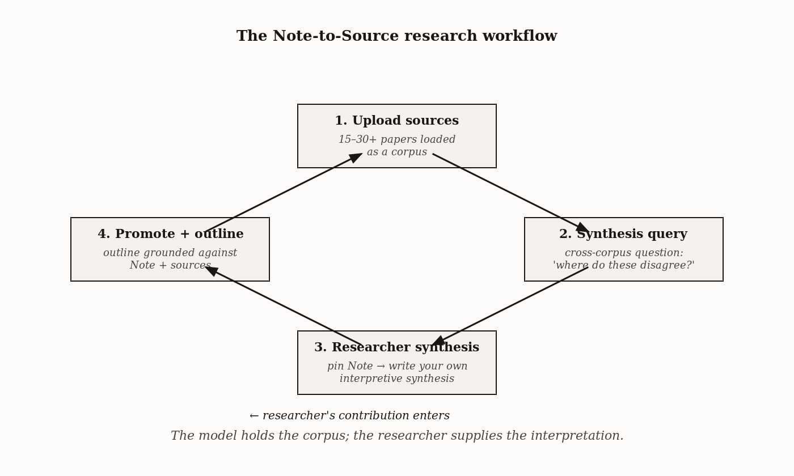

# Chapter 9 — Higher Education: Research, Literature, and the Synthesis Problem

*For graduate students and faculty, NotebookLM is most valuable when the reading load is high, the sources are curated, and the goal is synthesis across sources — not generation from thin air.*

---

Here is a problem that every graduate student recognizes and no one has a satisfying solution for. You have forty papers to master before a comprehensive exam. The papers do not form a neat stack — they cluster around three theoretical frameworks, the cluster boundaries are blurry, and the relationships *among* the frameworks are precisely what the exam will test. You have two weeks.

In the standard approach, you read each paper carefully, take notes, and build your own synthesis by hand. Two weeks is tight. You arrive at the exam with the synthesis still partial — not because you read carelessly, but because holding forty papers' methodologies, findings, and contradictions in working memory simultaneously is not something human working memory was designed to do.

This is not a reading problem. It is an architecture problem. And it has a specific solution.

---

## What the tool is actually for

Most people who open NotebookLM for the first time try it on a single paper. They upload one article, ask for a summary, get a reasonable summary. The acceleration is modest — maybe they saved fifteen minutes. They conclude the tool is a convenient shortcut for busy days and do not think further about it.

This is the least leveraged use case. It is like testing a freight train by carrying one suitcase.

The leverage appears at the *corpus* level — when fifteen to forty or more sources are loaded and you query across all of them simultaneously. The query that is impossible to execute by reading papers one at a time becomes tractable when the corpus is loaded as a whole.

A typical cross-corpus query:

> *"Analyze the methodology sections of the five uploaded papers on behavioral economics. Synthesize their sample sizes, variables, and experimental limitations into a markdown table. Identify where these authors contradict one another regarding the role of cognitive bias."*

What this query requires: holding five papers' methodology sections in working memory at the same time, comparing them on the same dimensions, and noticing where the divergences are. That is precisely what human working memory cannot do across five papers simultaneously and what the tool can. The model does the holding; you do the noticing-and-judging that follows.

The distinction matters for understanding what you are buying with the tool. You are not buying a judgment machine. You are buying working memory extension — a way to operate on a corpus at the level of the whole rather than paper by paper. The judgment is still yours. The synthesis question, the verification, the interpretation of what the contradictions mean — those are still yours. What the tool supplies is the scaffold on which your judgment can operate at a scale that would otherwise be intractable.

| | Single source | Cross-corpus |
|---|---|---|
| **What the query asks** | "Summarize this paper" or "What does this paper say about X?" | "Across these N papers, where do the methodologies disagree? Where does the field converge?" |
| **What the model holds in memory** | One source's contents | N sources held simultaneously, with the structural relationships among them queryable |
| **What the researcher supplies** | Reading time; basic verification of summary | Curation (which papers belong); structural questions; verification of each synthesis claim; interpretive judgment about what the synthesis means |
| **Approximate time savings** | Modest (5–20%) vs. careful reading alone | Substantial (week-scale to afternoon-scale) for tasks involving structural cross-reference |

*The leverage is not in any single operation. It is in operating on the corpus as a whole.*
---

## The graduate student and her forty papers

Let me make the opening case concrete with how it actually played out for one researcher.

A doctoral student in education research, preparing for comprehensive exams, uploads all forty papers to a single notebook. She queries: *"Across these forty papers, what are the three most cited theoretical frameworks, and which papers use each? Where do the frameworks contradict each other in their predictions?"*

The notebook returns a structured response with citations. She verifies the framework attributions against each paper — two attributions are wrong, she corrects them — and then has a verified synthesis matrix in an afternoon. She still reads each paper closely. The synthesis layer is what NotebookLM added.

The afternoon-instead-of-a-week is the high-leverage acceleration. Notice what it is not: it is not the model doing her reading. She still reads every paper. It is not the model doing her synthesis. She still interprets the frameworks and their relationships. What the model contributed is the extraction layer — pulling the framework attributions from forty papers simultaneously so that she can verify them, correct them, and work with them, rather than constructing them from scratch by hand.

Two attributions were wrong. This is the crucial detail, and not because two errors out of forty is an alarming rate. It is crucial because it tells you the correct posture toward the output. The model's extraction is *auditable*, not *reliable without audit*. The audit is the verification step; it takes far less time than building the matrix from scratch, but it is not optional. A researcher who skips verification and publishes the model's extraction is not accelerating their work — they are delegating their credibility to a process that makes errors at a non-trivial rate.

Source-grounded means errors are *findable*, not that they do not exist.

*Figure 9.1 — Simple two-bar comparison *

---

## The Note-to-Source loop as a research workflow

There is a feature in NotebookLM that takes on a specific and powerful form in research contexts. Chapter 3 introduced it as the Note-to-Source loop. Here it becomes the mechanism for a particular kind of scholarly contribution.

The sequence: upload fifteen to thirty papers. Generate a synthesis query in chat. Pin the model's response as a Note. Promote the Note to a source. Then generate a research outline grounded against the Note and the original papers together.

What this produces is an outline structured around *your* interpretive synthesis — not the original papers' separate framings. The Note becomes the contribution; the outline shows how the papers support or complicate it.

A specific example. A doctoral candidate uploads twenty-five papers on retrieval-practice interventions in adult learners. Reading them, she notices the papers split into two camps on whether spaced practice retains its advantage in adult-learner contexts. She writes a Note: *"There is a tension between Group A (Karpicke et al.) and Group B (Cepeda et al.) on whether spaced practice retains its advantage in adult-learner contexts. My thesis argues this tension is resolved by attending to the working-memory load variable across studies."*

She promotes the Note to source. Generates an outline. The outline surfaces which papers support the working-memory-load synthesis, which contradict it, and where additional reading is required.

Now here is the point worth dwelling on. The Note is what the model cannot produce. It captures the interpretive synthesis that requires having read the papers carefully, noticed the contradiction, and formed a theoretical argument about what resolves it. That is the scholar's work. The outline — the structure, the coverage mapping, the citation tracking — is what the model *can* produce against that synthesis.

*Figure 9.1 — The Note-to-Source research workflow*

The loop makes the labor split explicit. It forces you to articulate what is yours — your synthesis, your theoretical argument, your interpretive claim — and inserts it into the corpus so that subsequent outputs are grounded against it. Researchers who skip this step and use the model's synthesis as their own are not just committing a kind of academic-integrity error. They are giving away the work that cannot be delegated and delegating only the work that can. They have the ratio backwards.

---

## What the tool cannot do

The chapter needs to be explicit about this, because the fluency of the model's outputs makes it easy to mistake echo for judgment.

**Domain judgment.** Whether a finding matters requires knowing the field's evolving questions, methodological debates, and what the current center of gravity is. The model has access to text. It does not have access to which questions are live, which methods are contested, or which results the field considers important. A model trained on a corpus of papers knows what the papers say. It does not know what the field is *doing*.

**Significance assessment.** A correlation can be statistically significant and theoretically trivial, or statistically modest and theoretically central. Distinguishing requires the theoretical framework the work lives in. The model can extract effect sizes; it cannot tell you whether an effect size is large enough to matter for your question.

**Methodological critique.** Identifying that a paper's sample is non-representative, that its design has a confounder, that its conclusion overreaches its data — these require methodological expertise the tool can echo but not perform. The model can describe a paper's design accurately. It cannot evaluate whether the design is adequate.

**Citation context.** Whether a paper is foundational, actively contested, or quietly superseded depends on the field's narrative arc, which is not recoverable from citation counts alone. A paper cited twelve hundred times may be cited because everyone must cite it before arguing against it. The model can tell you the paper was cited twelve hundred times. It cannot reliably tell you what the field thinks of it now.

| Research task | Tool can perform? | What the researcher must supply |
|---|---|---|
| Extract sample sizes across 20 papers into a markdown table | Yes | Verification — check each extracted value against the source |
| Identify methodological contradictions across studies | Partially | Domain judgment about whether the contradiction is real or terminological |
| Assess whether a finding is statistically significant *and* substantively important | No | Theoretical framework that distinguishes the two |
| Critique a study's design (sampling bias, confounds, generalizability limits) | No | Methodological expertise the model doesn't have |
| Determine a paper's current standing in the field (foundational / contested / superseded) | No | Citation context, field narrative arc, knowledge of who has revised whom |

*The tool accelerates extraction and scaffold-building. It cannot perform the judgment that makes those outputs meaningful.*
These limitations are not arguments against using the tool. They are arguments for knowing precisely where your work begins. The researcher who has internalized this boundary uses the tool well. The researcher who has not will mistake fluent extraction for expert judgment and will be wrong in ways that are hard to detect from the output alone.

---

## A worked workflow for a literature review

Here is what the cross-corpus synthesis workflow looks like when it is working correctly.

You are reviewing intervention-effect literature across fifteen studies. You begin with curation — identifying the fifteen papers. This step cannot be delegated to the tool, and it is the highest-leverage step in the entire workflow. The quality of the synthesis is capped by the quality of the corpus. Garbage sources produce garbage synthesis quickly and plausibly.

Once the sources are uploaded, you verify that each one was ingested correctly by asking a specific factual question about its content — not "did you receive this?" but "what sample size does this paper report?" A paper that was not properly ingested will fail that question; you catch it before building anything on it.

Then the synthesis query:

> *"For each of the fifteen papers, extract: sample size, intervention type, primary outcome measure, effect size, methodological design. Return as a markdown table. Identify rows where the studies' findings disagree."*

The model returns a table. You verify every cell against the source papers. For fifteen papers and five columns, that is seventy-five cells; expect five to ten corrections. This is the verification work, and it is not optional. A synthesis matrix with uncorrected errors is worse than no synthesis matrix — it gives you false confidence about what the literature says.

Once the matrix is verified, you write the synthesis interpretation in chat: what the pattern is, where the disagreement is, what you think it means. Pin it. Promote it to source. Generate the outline against the matrix plus your synthesis Note.

Then iterate. Re-read the highest-leverage papers — the ones where the disagreement concentrates, the methodologically strongest ones, the ones whose claims your synthesis rests on. Refine the Note. Regenerate the outline.

What you end up with is a literature-review outline grounded in verified evidence and your own interpretive synthesis, ready to draft against. The time: roughly one focused afternoon for fifteen papers, compared to one focused week for the hand-built version. The acceleration is in the extraction and the scaffold. The reading, the judgment, and the interpretation are still yours.

*Figure 9.2 — Seven-step literature review workflow as a numbered visual*

---

## The privacy constraint is a workflow step

Research contexts introduce data-sensitivity problems that K–12 deployment does not. A researcher may have IRB-restricted interview transcripts, pre-publication manuscripts under embargo, confidential institutional documents, patient records governed by HIPAA, or proprietary materials under contractual restriction.

The institutional guidance at this writing — including explicit guidance from UIC — is clear: do not upload materials in these categories unless you have confirmed that HIPAA, FERPA, IRB, and institutional terms are satisfied for the processing involved. The Workspace for Education account provides compliance for student educational records; research data is governed by different frameworks, and the researcher is responsible for knowing which framework applies to each source before uploading it.

This is not a footnote. It is a workflow step. Before uploading any source to a research notebook, identify its data-sensitivity class. Published papers with no restrictions: upload. IRB-restricted interview transcripts: check with your IRB and your institution's research computing office before uploading. Pre-publication manuscripts: check the embargo terms. Patient records: the answer is almost certainly no without specific institutional clearance.

The failure mode is uploading first and asking later. By the time you ask, the data has already been processed. The correct sequence is the reverse.

---

## Deep Research and the boundary problem

A feature note that requires careful framing. In November 2025, Google added Deep Research mode to NotebookLM. Deep Research can search the web for material not in your uploaded sources and incorporate it into its responses.

For finding sources to add to your corpus — running a web search to identify papers you may have missed, following citation trails — Deep Research mode is useful. It is doing reconnaissance, not synthesis, and you control what enters the verified corpus.

For synthesizing, it is a problem. Deep Research's web-retrieved material is not in your verified corpus. It is not grounded against sources you have read and curated. The output may incorporate claims from papers you have not vetted, from sources of unknown quality, from preprints that were later retracted. The audit trail that makes the bounded-tool workflow trustworthy disappears.

The operational rule: use Deep Research mode for *finding*, not for *synthesizing*. Anything retrieved via web search that you want to rely on needs to be added to the corpus as a verified source before you synthesize against it. The boundary is the point of the workflow; Deep Research mode can dissolve that boundary if you let it.

---

## The irreducible problem

There is a version of the comprehensive-exam preparation story where the graduate student does not write her own synthesis Note, does not verify the framework attributions, and submits the model's output as her interpretive synthesis. The exam goes badly — not because the model was wrong about which papers used which frameworks, but because the examiner asks her to explain *why* the frameworks contradict each other, and she does not know. She has a fluent synthesis she did not produce and cannot defend.

The tool is most dangerous for the researcher who uses it to avoid the reading, not to accelerate it. The acceleration is in the extraction layer — the pulling of sample sizes, the mapping of which papers belong to which framework, the surface-level contradiction detection. The reading, the theory, the judgment about what matters: none of that is accelerated, because none of it is in the extraction layer. It is in the thirty years of accumulated domain knowledge that makes the reading meaningful.

Feynman had a name for the failure mode — knowing the name of something instead of knowing the thing. The researcher who can produce a fluent synthesis from a NotebookLM session without having read the papers knows the *output* of synthesis without knowing the *thing* the synthesis is about. The exam reveals it. The peer reviewer reveals it. The dissertation committee reveals it.

The tool works when it is extension of the researcher's capability, not a substitute for the researcher's knowledge. The distinction is not sentimental. It is structural — and now you can see exactly where the structure runs.

---

## Exercises

**Warm-up**

1. *(Apply — corpus level vs. single source)* Upload three papers from a current research task to a single notebook. Run the same summary query three times — once specifying only paper one, once specifying only paper two, once querying across all three. Describe in one sentence what the cross-source query produces that the individual queries cannot.

2. *(Apply — verification posture)* Upload one paper you know well. Ask NotebookLM to extract its sample size, primary outcome measure, and main finding. Verify each extracted claim against the source. Record how many required correction. This is your baseline error rate for a familiar source.

3. *(Apply — data sensitivity)* List five sources you would consider uploading for a current literature review. For each, identify its data-sensitivity class: unrestricted published paper, pre-publication manuscript, IRB-restricted data, proprietary material, or other restricted category. Identify which, if any, require institutional clearance before upload.

**Application**

4. *(Apply — cross-corpus synthesis query)* Build a notebook with at least eight papers on a topic you are actively researching. Write a query that asks the model to extract one methodological variable across all papers and return it as a table. Verify every cell. Document the corrections. What does the error pattern tell you about which kinds of extraction the model handles reliably and which it does not?

5. *(Analyze — Note-to-Source loop)* Upload ten papers and generate a synthesis query. Before promoting any Note to source, write your own interpretive synthesis in one paragraph — what you believe the papers collectively argue, where the tension is, and what your position is on that tension. Compare your synthesis to the model's. Identify the specific claims in yours that are absent from the model's. Those are your contribution.

6. *(Analyze — Deep Research boundary)* You are building a literature review and discover that Deep Research mode has surfaced three papers not in your corpus that seem highly relevant. Describe the exact steps you would take to incorporate these papers into your synthesis workflow correctly — and explain why querying across them without those steps would be a problem.

**Synthesis**

7. *(Evaluate — tool capability boundary)* Take a synthesis output NotebookLM produced for you from a multi-paper notebook. Identify one claim in that output where domain judgment would change the interpretation, one claim where methodological expertise would change it, and one claim where citation-context knowledge would change it. For each, write one sentence explaining why the model cannot perform that correction itself.

8. *(Evaluate — the ratio)* A colleague tells you she ran her entire literature review through NotebookLM without verifying individual cells or writing her own synthesis Note, and the output looks good. Identify what she has and has not done, using the framework from this chapter. What is she most likely to discover when her dissertation committee asks her to defend a specific interpretive claim?

**Challenge**

9. *(Create — full workflow)* Execute the complete seven-step literature review workflow from the chapter on a current research task with at least fifteen sources. Document the time spent at each step. At the end, write a one-paragraph assessment of where the acceleration was real, where it was not, and what you would do differently in a second iteration.

10. *(Evaluate — the irreducible boundary)* The chapter argues that domain judgment, significance assessment, methodological critique, and citation context cannot be performed by the tool. Choose one of these four and argue the strongest possible case that a sufficiently capable future model *could* perform it. Then identify the one thing about the nature of that capability that your argument cannot fully account for.
