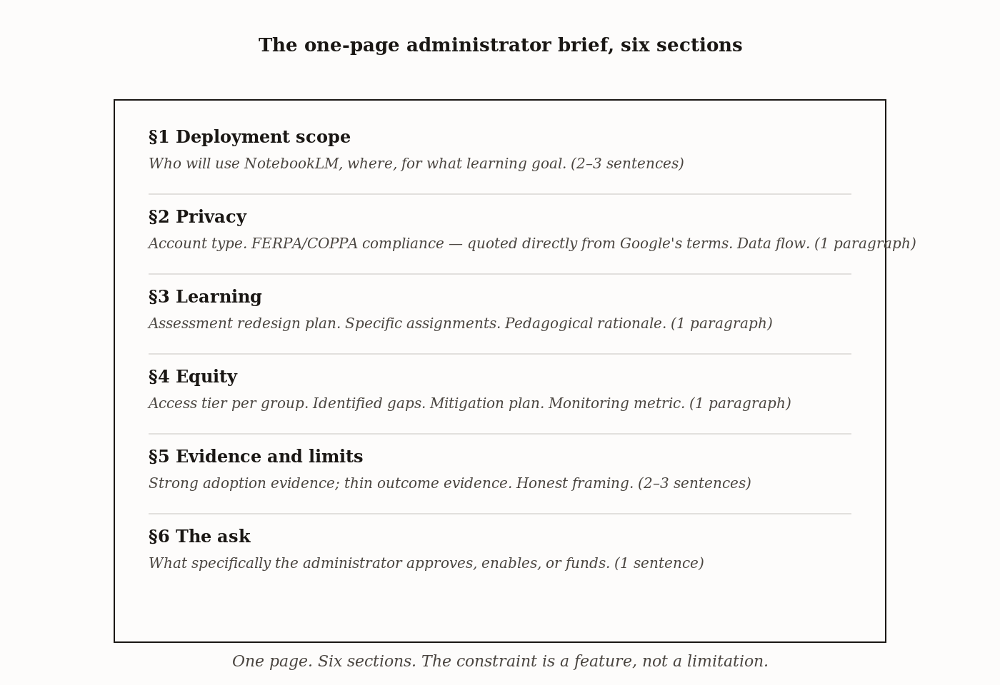

# Chapter 13 — The Administrator Brief: How to Defend Your Deployment

## TL;DR

- Administrators will ask three questions.
- The chapter moves through Why the questions are always the same three, The structure of the answer, Answering the first question: is student data safe?, Answering the second question: will students stop learning?, and related ideas.
- Read it for the main argument, the vocabulary it introduces, and the practical judgment it asks you to develop.

*Administrators will ask three questions. This chapter gives you the answers.*

---

Here is the situation this chapter is designed for. You have done the work. You have read the chapters on output types and assignment design and equity and privacy. You have a deployment that is thoughtfully structured, with the three gates open, with the assessment redesigned, with the equity gaps named and mitigated. You are ready to run the lesson.

And then you need someone's approval.

The administrator, the department chair, the school board — whoever controls the institutional go-ahead — is not going to read the chapters you read. They are going to ask questions, and the questions will cluster around three things: whether student data is safe, whether students will stop learning, and whether all students have equal access. These are the correct questions for someone responsible for the institution to ask. They are not obstacles. They are the job.

The brief is how you answer those questions before they are asked, in a form the administrator can act on. This chapter teaches the brief.

---

## Why the questions are always the same three

Administrators vary enormously in their knowledge of specific tools, their comfort with technology, and their institutional context. What they share is accountability — they are responsible for outcomes they did not directly produce, and they carry consequences for decisions they had to make with incomplete information.

Three categories of consequence concentrate their attention.

The first is legal and regulatory exposure. If student data is mishandled — if FERPA is violated, if COPPA is not satisfied, if a parent complaint triggers an audit — the administrator is accountable. "Is student data safe?" is not curiosity; it is risk management.

The second is educational outcome. The administrator's job is to protect the learning environment. "Will students stop learning?" is the short form of a longer question: does this tool displace the cognitive work that produces learning, or does it support it? Administrators who have watched previous ed-tech deployments promise transformation and deliver distraction are right to ask the question skeptically.

The third is equity and access. A deployment that works for some students and not others creates an internal equity problem, potential family complaints, and sometimes a civil-rights exposure. "Do all students have equal access?" is the question that catches subscription-tier inequity, language-coverage gaps, and age restrictions that the educator may have missed.

These three questions are not going to change. The tool will change. The specific privacy regime will evolve. The research evidence will accumulate. The administrator's accountability structure will stay the same, and the three questions will keep clustering around it.

A brief that answers all three — honestly, with its gaps stated — is not a sales document. It is a professional communication between someone who understands the deployment and someone who is responsible for its institutional consequences.

---

## The structure of the answer

A one-page document. Six sections. No more.

The length discipline is not arbitrary. It is calibrated to how administrators read. An administrator presented with a white paper reads the executive summary and skims the rest. An administrator presented with one clean page reads the whole thing. If it runs to two pages, they read less of it, not more. The constraint is a feature of the format.

*Figure 13.1 — The one-page brief, six sections*

**Section one: deployment scope.** Two to three sentences. Who will use NotebookLM, in what context, for what specific learning goal. Not "AI will enhance student learning" — that is a category, not a deployment. "Twenty-eight ninth-grade students will use teacher-created NotebookLM notebooks to generate evaluative short-answer responses in preparation for a structured Friday discussion on the causes of the French Revolution." Specific enough that the administrator knows exactly what is being approved.

**Section two: privacy.** One paragraph. The account type students will use. A direct quotation from Google's published Workspace for Education terms confirming that data is not used for model training and that FERPA and COPPA compliance applies. Not a paraphrase — the original language. Paraphrase invites "but does that actually mean...?" and the conversation rewinds. Direct quotation lets legal counsel verify the source themselves and shortens the approval chain by a step.

**Section three: learning.** One paragraph. The assessment redesign plan. Specific assignments that have been redesigned so that the work the tool cannot substitute for — argument formation, evidence judgment, position defense — is still required of the student. A pedagogical rationale that names the cognitive-science basis. And an honest acknowledgment: the integrity concern is legitimate, the response is design rather than prohibition, and here is what the design looks like.

**Section four: equity.** One paragraph. Which students have full access. Which students have constrained access and why — age restriction, quota limit, language-coverage gap. The mitigation plan for constrained students. The monitoring plan: how will the institution verify that the equity outcomes match the intentions.

**Section five: evidence and what is not yet known.** Two to three sentences. What the evidence shows — strong adoption patterns, practitioner reports, the research partnerships generating formal outcome data in 2026. What the evidence does not yet show — controlled comparison studies at scale. The deployment is designed to contribute to the evidence base, not to wait for it.

**Section six: the ask.** One sentence. What specifically the administrator is being asked to approve, enable, or fund. "I am requesting approval to proceed with the deployment described above in my third-period class beginning the week of November 10." Concrete. Bounded. Actionable.

*Figure 13.1 — The six sections as a visual layout of*

---

## Answering the first question: is student data safe?

The operative distinction is between Workspace for Education accounts and personal Gmail accounts — Chapter 11's central argument, condensed here to one paragraph for the brief.

Under a Workspace for Education account, Google does not use student data to train models. FERPA compliance applies. COPPA compliance applies for under-13 data when the account is properly configured. GDPR compliance applies for EU contexts under Google's standard Workspace for Education terms. The school's IT infrastructure has visibility into what is being processed and under what governance.

Under a personal Gmail account, none of those protections are guaranteed. The brief must specify which account type students will use, and the answer must be the institutional account. If it cannot be the institutional account — if the district has not enabled NotebookLM for students, if the admin toggle is closed — the brief cannot honestly claim the privacy protections that justify deployment. The answer to "is student data safe?" depends on which account is actually in use, and that is a factual question with a verifiable answer.

| | Workspace for Education | Personal Gmail |
|---|---|---|
| Data used for model training | No | Yes (per Google's standard terms unless explicitly opted out) |
| FERPA compliance | Yes | No |
| COPPA compliance (under-13) | Yes (with proper configuration) | No |
| GDPR compliance (EU contexts) | Yes (per Workspace for Education terms) | Conditional |
| Institutional IT visibility | Yes | No |
| Under-18 content guardrails | Specialized for minors | Standard filters only |

*The brief's privacy section quotes the institutional account row directly from Google's published terms. It does not paraphrase.*
The brief should not say "NotebookLM is private and secure" without specifying which account type is in use. That framing is technically accurate for the institutional account and dangerously misleading for the personal account. The administrator reading the brief will not know which applies unless the brief says so.

---

## Answering the second question: will students stop learning?

This is the question that requires the most careful framing, because the administrator's default response to academic integrity concerns is often ban-and-detect — prohibit the tool, monitor for violations, penalize use. The brief's job is not to argue that the concern is wrong. It is to walk the administrator through why that response does not solve the problem, and what does.

The detection problem: AI-generated text detection tools have documented false-positive rates that fall disproportionately on non-native English writers and students who write in formal registers. A detection-based enforcement regime creates a civil-rights exposure in the same brief that is supposed to address risk. The administrator needs to understand this before committing to it.

The design response: assessments structured so that the work requiring judgment, position defense, and situated knowledge — things the tool cannot do for the student — is the work being assessed. An Audio Overview can summarize the causes of the French Revolution. It cannot defend a specific causal claim in front of a class that will challenge it. The assessment designed around the defense evaluates what the summary cannot replace.

The evidence: the 2025 MDPI finding that ethical beliefs predict AI behavior more strongly than policy awareness tells you something important about the integrity mechanism. A policy that says "do not use AI without disclosure" produces compliance driven by fear of detection. A shared moral reasoning component — students understanding *why* the distinction between AI-assisted and AI-substituted work matters, not just that there is a rule — produces behavior driven by internalized values. The brief should name both the policy layer and the reasoning layer.

What the administrator needs to see: specific assessments that have been redesigned, the pedagogical rationale for each, and an honest acknowledgment that the concern is legitimate and the response is design, not dismissal.

---

## Answering the third question: do all students have equal access?

The instinct, when writing this section of the brief, is to say that all students have access and move on. This is almost never fully true, and an administrator who approves a deployment on the basis of "all students have access" and later discovers tier-based gaps will trust the next proposal less.

Honest disclosure of access gaps is stronger than papered-over claims. Not because administrators reward honesty for its own sake — though some do — but because the administrator who knows the gaps can help close them, and the administrator who discovers them after approval cannot.

The equity section of the brief names three things: who has full access, who has constrained access and why, and what the plan is. "Full access" means all three gates open — admin toggle enabled, age eligibility satisfied, subscription tier sufficient for the assignment as designed. "Constrained access" means any one of those gates is partially or fully closed for a subset of students. The mitigation plan names the alternative assignment or instructor-mediated access available to those students. The monitoring plan names the metric — query completion rate, assignment completion rate, explicit check-in with affected students — that will tell you whether the mitigation is working.

| Section | What goes here |
|---|---|
| Students with full access | Count + criteria (e.g., "All ~340 students in grades 9–12 with district-issued accounts on the student OU") |
| Students with constrained access | Count + which gate + reason (e.g., "~80 students whose Chromebooks are home-shared; cannot create individual notebooks; constraint is hardware/account-sharing, not toggle") |
| Mitigation plan | Specific action (e.g., "Teacher-generated notebooks made available via Classroom for shared-device students; check-out laptop available for students who request one") |
| Monitoring metric | Specific measurement (e.g., "Monthly usage report from Google Workspace admin console; classroom-level survey at end of semester asking whether tool access was sufficient") |

*Naming the gap and the plan is stronger than claiming no gap exists. The administrator who knows the constraint can help address it.*
The subscription-tier question deserves explicit attention because it is the place where "free" most misleads. If the assignment requires more than 50 daily queries and the institutional account is on the free tier, some students will hit the limit during the assignment. That is a constraint. The brief names it, describes the staggering plan or the institutional licensing conversation, and gives the administrator the information needed to act. An administrator cannot solve a problem they have not been told about.

---

## The institutional credibility signals

Two references that belong in the brief because administrators can verify them.

Google announced in 2025 a partnership with ISTE and ASCD to provide free AI literacy training to six million K–12 and higher-education educators in the United States, with NotebookLM as a featured tool. This is publicly verifiable. It signals that NotebookLM deployment is consistent with mainstream educational practice — not an outlier move the administrator is being asked to take alone.

Google announced in May 2026 research affiliate partnerships with Purdue University, the University of Alabama, and UC Riverside to produce formal outcome data later in 2026. This is publicly verifiable. It signals that the tool is being studied by major research institutions under rigorous conditions, and that the evidence base the brief describes as "thin at scale" is actively being developed.

These are not arguments that the tool works. They are signals about where the tool sits in the institutional landscape. An administrator asked to approve a deployment has to make a judgment about risk — not just the risks addressed in the brief, but the institutional-reputational risk of being early on something that later turns out to be harmful, or the institutional-opportunity risk of being late on something that becomes standard practice. The credibility signals address the latter risk. The administrator can see that the deployment is consistent with what major educational organizations and research institutions are doing, and the decision is made with that context visible.

---

## The skeptical colleague test

Before sending the brief, have a specific kind of person read it: someone known to be skeptical of AI tools in education, who will ask the questions an adversarial administrator might ask. Not someone who will say it looks fine, and not someone who shares your enthusiasm for the deployment. Someone who will push.

The question the skeptical colleague is most likely to surface: something local, specific to your institution or community, that the standard three questions do not cover. What happens if a parent asks whether their child's homework is being used to train Google's AI? What happens if a student with a disability needs to use the audio features but the institutional licensing doesn't cover them? What happens if a teacher in the same department refuses to participate and students compare experiences?

These are not questions the chapter can answer in advance, because they depend on the specific institution. They are questions the skeptical colleague will surface, and the brief that does not address them will fail in the room with the administrator who has already thought of them.

The revision cycle is: write the brief, run it past the skeptical colleague, identify the gap, revise. Once. The brief should be ready to defend after one revision cycle. If it requires more than that, the deployment itself may not be ready.

---

## What honest framing actually looks like

The temptation when writing a deployment brief is to lead with outcomes. Learning outcomes, engagement metrics, productivity gains. The instinct is reasonable — the brief is supposed to make a case — but overstatement in the brief creates a specific problem that underselling does not.

An administrator who approves a deployment on the basis of "NotebookLM improves student grades by 15%" will hold you to that. When the deployment produces differentiated results — students who use the tool with strong design support show gains; students who use it without that support do not; the aggregate is noise — the administrator has been given false expectations. The next deployment brief has a harder climb because the first one overclaimed.

Honest framing says: here is what the practitioner evidence shows, here is what the controlled evidence does not yet show, and here is why this deployment is designed to produce the conditions under which the tool is most likely to help. That is a harder brief to write. It is also a brief the administrator can forward to the school board without legal risk and without the fear that a follow-up question will expose the underlying weakness.

The chapter's recommendation is not self-deprecation. It is accuracy calibrated to the evidence. The evidence for NotebookLM is strong on adoption, moderate on practitioner satisfaction, and thin on controlled outcome measurement at scale. A brief that reflects that accurately, and explains why the deployment is designed to contribute to the evidence rather than wait for it, is making an honest argument for a real thing. That argument, made consistently across multiple deployments, builds the institutional credibility that makes the next approval easier.

The brief is a professional communication, not a sales pitch. The difference is in whose interests it serves. A sales pitch serves the approval. A professional communication serves the institution. The administrator can usually tell which one they are reading.

---

## Exercises

**Warm-up**

1. *(Analyze — the three questions)* For a deployment you are currently planning or have recently completed, write one sentence answering each of the three administrator questions as you understand them right now. Do not write a brief yet — just the three sentences. Identify which answer is least defensible and why.

2. *(Analyze — scope specificity)* Rewrite the following deployment scope statement so it meets the chapter's specificity standard: "Students will use AI tools to help them learn about history." Your rewrite should name the student population, the specific tool, the specific task, and the specific learning goal it serves.

3. *(Analyze — the detection problem)* Identify the two specific reasons the chapter gives for why ban-and-detect is an inadequate response to AI academic integrity concerns. For each, write one sentence explaining what the administrator needs to understand about it before committing to a detection-based policy.

**Application**

4. *(Apply — privacy section)* Locate Google's published Workspace for Education terms for NotebookLM. Find the specific language confirming that student data is not used for model training. Copy the exact sentence or phrase. Then write the one-paragraph privacy section of a brief using that exact quotation — not a paraphrase — as its anchor. Verify that your paragraph specifies which account type students will use.

5. *(Apply — equity section)* For a specific deployment, complete the equity section template from the chapter: identify the count of students with full access and the criteria, the count with constrained access and which gate is closed, the mitigation plan, and the monitoring metric. If all three gates are open for all students, identify the equity dimension most likely to create a gap in the next iteration of this deployment.

6. *(Apply — the full brief)* Write the complete one-page brief for a deployment you are planning or proposing. All six sections, one page, specific ask at the end. Before sending it to anyone, verify it against the chapter's length constraint: it should fit on one printed page in a readable font.

**Synthesis**

7. *(Evaluate — honest framing vs. overclaiming)* Review a brief you have written or a public institutional communication about an AI deployment (EDUCAUSE archives or district communications are good sources). Identify one claim that overclaims the evidence and one claim that is appropriately calibrated. For the overclaim, rewrite it in the honest-framing register the chapter describes.

8. *(Evaluate — the skeptical colleague test)* Identify the person in your professional context who is most skeptical of AI tools in education. Give them your draft brief. Ask them one question: "What would an adversarial administrator ask that this brief doesn't answer?" Document their response. Revise the brief to address it. Describe in two sentences what the revision changed and why the skeptical colleague's question was one you had not anticipated.

**Challenge**

9. *(Evaluate — the fourth question)* The chapter argues that administrators will always ask the same three questions. Identify one question that is specific to your institution, community, or student population that the standard three do not cover — a question an adversarial administrator or an engaged parent in your context would ask that is not privacy, learning outcomes, or equity. Write the section of the brief that addresses it, using the chapter's structural principles: honest framing, direct evidence citation where available, and explicit acknowledgment of what is not yet known.

10. *(Create — the re-briefing question)* The chapter's "Still puzzling" section raises the question of re-briefing cadence: once at adoption, or annually as the tool and evidence evolve? Write a one-paragraph argument for the position you find more defensible, using the chapter's institutional-trust framework. Then write one sentence identifying the specific condition under which you would switch to the other position.
